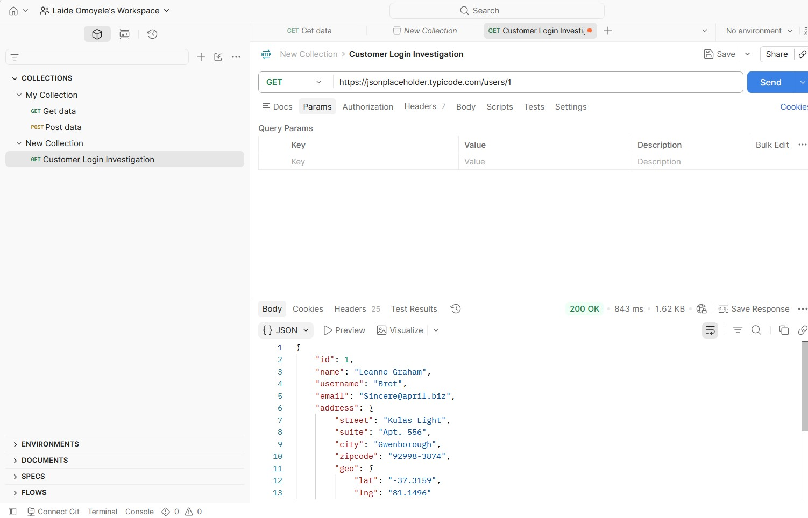

# Postman Basics

## Introduction

Postman is a tool used to send API requests and inspect API responses without using the application itself.

For Product Support Engineers, Postman is a valuable troubleshooting tool that helps verify whether an API is working correctly before escalating issues to Engineering.

---

# Why Product Support Engineers Use Postman

Postman helps support teams:

- Test API endpoints.
- Verify whether an issue can be reproduced.
- Inspect API responses.
- Identify HTTP status codes.
- Gather technical evidence before escalating issues.
- Reduce unnecessary Engineering escalations.

---

# How Postman Works

Instead of opening the application, Postman communicates directly with the server.

The workflow looks like this:

Customer Issue

↓

Support Investigation

↓

Postman

↓

API Request

↓

Server

↓

API Response

↓

Support Decision

---

# Common HTTP Methods

## GET

Used to retrieve information.

Example:

Retrieve customer account details.

---

## POST

Used to create new information.

Example:

Create a new customer account.

---

## PUT

Used to update existing information.

Example:

Update customer profile.

---

## DELETE

Used to remove information.

Example:

Delete a customer account.

---

# Example Scenario

### Customer Report

> "I cannot log into my account."

Support Investigation

Instead of immediately escalating the issue, the Product Support Engineer tests the Login API using Postman.

Possible API responses:

**200 OK**

The login service is working.

Continue investigating customer-specific issues.

---

**401 Unauthorized**

The customer's credentials are invalid.

Advise the customer to verify their login details or reset their password.

---

**500 Internal Server Error**

The login service is failing.

Collect evidence and escalate the issue to Engineering.

---

# Benefits of Using Postman

- Confirms whether an API is working.
- Helps isolate customer issues from server issues.
- Provides evidence for Engineering teams.
- Improves troubleshooting efficiency.
- Supports faster issue resolution.

---

# Key Takeaways

✔ Postman is an API testing tool.

✔ Product Support Engineers use Postman to investigate customer issues.

✔ Postman helps verify API responses before escalating.

✔ HTTP status codes returned in Postman help identify the source of a problem.

✔ Effective use of Postman improves customer support and reduces unnecessary escalations.

## Hands-on Practice (Postman)

I used Postman to understand how Product Support Engineers investigate API responses.

### Test 1 — Successful API Request

**Endpoint**
GET https://jsonplaceholder.typicode.com/users/1

**Result**

- Status Code: **200 OK**
- The API returned the requested user information successfully.
- This confirms the endpoint is available and functioning correctly.

📷 Screenshot:

---

### Test 2 — Authentication Error

**Endpoint**
GET https://reqres.in/api/users/2

**Result**

- Status Code: **401 Unauthorized**
- The response indicated a missing API key.
- This demonstrates how authentication failures appear during API testing.

📷 Screenshot:

---

### Test 3 — Resource Not Found

**Scenario**

A customer reports that a user profile cannot be loaded.

**Endpoint**

GET https://jsonplaceholder.typicode.com/users/999

**Result**

- Status Code: 404 Not Found
- The requested resource does not exist.
- This could happen if the customer requested an invalid resource ID or the resource has been deleted.

**Support Action**

- Verify the resource ID.
- Ask the customer to confirm the correct information.
- If the resource should exist but does not, escalate to Engineering.

📷 Screenshot:

---

# Hands-on Practice

## Scenario 1 – Successful API Request (200 OK)

A successful API response confirms that the endpoint is reachable and returns the expected customer data.

**Support Interpretation**

- API endpoint is healthy.
- Customer data is returned successfully.
- No server issue detected.
- Continue investigating the customer's account if they still report a problem.

---

## Scenario 2 – Authentication Failure (401 Unauthorized)

This response indicates that authentication credentials are missing or invalid.

**Support Interpretation**

- Missing API key or invalid credentials.
- Verify authentication settings.
- Ask the customer to log in again or regenerate credentials if applicable.
- Escalate only if valid credentials still return 401.

---

## Scenario 3 – Resource Not Found (404 Not Found)

A 404 response indicates that the requested resource or endpoint cannot be located.

**Support Interpretation**

- Incorrect endpoint or resource ID.
- Confirm the URL with documentation.
- Verify the customer is requesting an existing resource.
- Escalate only if the endpoint should exist.

### What I Learned

- A **200 OK** response confirms the request was processed successfully.
- A **401 Unauthorized** response usually indicates missing or invalid authentication credentials.
- Postman helps Product Support Engineers verify whether an issue is caused by authentication or by the application itself before escalating to Engineering.

---

**Next:** [05-Real-Support-Cases.md](./05-Real-Support-Cases.md)
